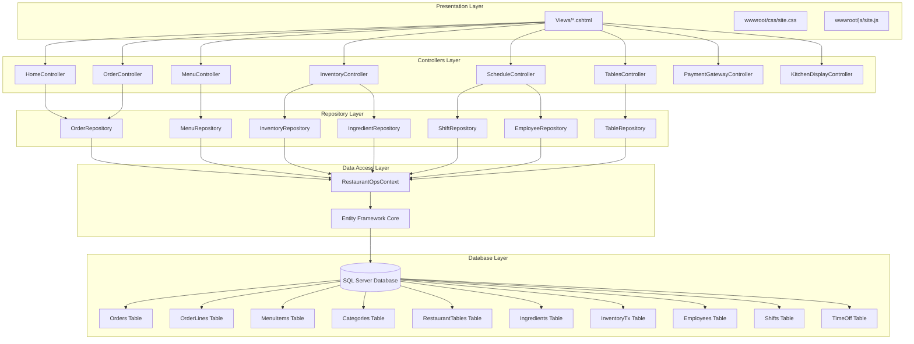

# RestaurantOps Legacy Application Architecture

## Overview
RestaurantOps is a legacy ASP.NET Core MVC application for restaurant management, built with Entity Framework Core for type-safe data access.

## Architecture Diagram



## Technology Stack

### Frontend
- **Framework**: ASP.NET Core MVC
- **View Engine**: Razor (.cshtml)
- **Styling**: Bootstrap 5.3.2
- **JavaScript**: jQuery 3.7.1
- **Validation**: jQuery Validation

### Backend
- **Framework**: ASP.NET Core 9.0
- **Pattern**: MVC (Model-View-Controller)
- **Data Access**: Entity Framework Core with SQL Server
- **Configuration**: appsettings.json

### Database
- **Database**: SQL Server
- **Schema**: Traditional relational design with EF Core migrations
- **Connection**: Connection string in appsettings.json

## Key Components

### Controllers
- **HomeController**: Landing page and error handling
- **OrderController**: Order management (create, view, submit, close)
- **MenuController**: Menu item management
- **InventoryController**: Inventory tracking and reorder reports
- **ScheduleController**: Employee scheduling and time-off management
- **TablesController**: Restaurant table management
- **PaymentGatewayController**: Payment processing
- **KitchenDisplayController**: Kitchen order display

### Repositories
- **OrderRepository**: Order CRUD operations using EF Core
- **MenuRepository**: Menu item operations using EF Core
- **InventoryRepository**: Inventory management using EF Core
- **EmployeeRepository**: Employee data operations using EF Core
- **ShiftRepository**: Shift scheduling using EF Core
- **TableRepository**: Table management using EF Core
- **IngredientRepository**: Ingredient tracking using EF Core

### Data Models
- **Order/OrderLine**: Order management with navigation properties
- **MenuItem/Category**: Menu structure with relationships
- **RestaurantTable**: Table management
- **Ingredient/InventoryTx**: Inventory tracking with relationships
- **Employee/Shift/TimeOff**: Employee scheduling with navigation properties

## Entity Framework Core Configuration

### DbContext
The application uses `RestaurantOpsContext` as the main EF Core DbContext:

```csharp
public class RestaurantOpsContext : DbContext
{
    public DbSet<Order> Orders { get; set; }
    public DbSet<OrderLine> OrderLines { get; set; }
    public DbSet<MenuItem> MenuItems { get; set; }
    // ... other entities
    
    protected override void OnModelCreating(ModelBuilder modelBuilder)
    {
        // Entity configurations and relationships
    }
}
```

### Entity Relationships
- **Order ↔ OrderLine**: One-to-many relationship
- **Order ↔ RestaurantTable**: Many-to-one relationship
- **MenuItem ↔ Category**: Many-to-one relationship
- **OrderLine ↔ MenuItem**: Many-to-one relationship
- **Employee ↔ Shift**: One-to-many relationship
- **Employee ↔ TimeOff**: One-to-many relationship
- **Ingredient ↔ InventoryTx**: One-to-many relationship

### Navigation Properties
All entities include navigation properties for EF Core relationships:
- `Order.Lines` - Collection of order lines
- `Order.Table` - Associated restaurant table
- `MenuItem.Category` - Associated category
- `Category.MenuItems` - Collection of menu items
- `Employee.Shifts` - Collection of shifts
- `Employee.TimeOffs` - Collection of time-off requests

## Dependency Injection Infrastructure

The application uses ASP.NET Core's built-in DI container for service registration:

### Repository Interfaces
- **IOrderRepository**: Order CRUD operations
- **IMenuRepository**: Menu item operations
- **ITableRepository**: Table management
- **IIngredientRepository**: Ingredient tracking
- **IInventoryRepository**: Inventory management
- **IEmployeeRepository**: Employee data operations
- **IShiftRepository**: Shift scheduling

### Service Registration
All repositories and EF Core services are registered in `Program.cs`:
```csharp
// Add Entity Framework Core
builder.Services.AddDbContext<RestaurantOpsContext>(options =>
    options.UseSqlServer(builder.Configuration.GetConnectionString("Default")));

// Register repositories
builder.Services.AddScoped<IOrderRepository, OrderRepository>();
builder.Services.AddScoped<IMenuRepository, MenuRepository>();
// ... other repositories
```

### Controller Injection
Controllers use constructor injection to receive repository dependencies:
```csharp
public class OrderController : Controller
{
    private readonly IOrderRepository _orderRepo;
    
    public OrderController(IOrderRepository orderRepo)
    {
        _orderRepo = orderRepo;
    }
}
```

## Data Flow

1. **Request Flow**: HTTP Request → Controller → Repository → DbContext → Database
2. **Response Flow**: Database → DbContext → Repository → Controller → View → HTTP Response

## Database Schema

### Core Tables
- **Orders**: Restaurant orders with status tracking
- **OrderLines**: Individual items in orders
- **MenuItems**: Menu offerings with pricing
- **Categories**: Menu categorization
- **RestaurantTables**: Physical dining tables

### Inventory Tables
- **Ingredients**: Raw materials tracking
- **InventoryTx**: Inventory transaction history

### Employee Tables
- **Employees**: Staff information
- **Shifts**: Work schedule management
- **TimeOff**: Time-off request tracking

## Configuration

### Connection String
Located in `appsettings.json`:
```json
{
  "ConnectionStrings": {
    "Default": "Server=...;Database=RestaurantOps;..."
  }
}
```

### Dependencies
- Microsoft.AspNetCore.Mvc
- Microsoft.EntityFrameworkCore.SqlServer
- Microsoft.EntityFrameworkCore.Tools
- Microsoft.EntityFrameworkCore.Design

## Database Migrations

The application uses EF Core migrations for database schema management:
- **InitialCreate**: Initial migration with all entity configurations
- **Migration Commands**: `dotnet ef migrations add <name>`
- **Update Database**: `dotnet ef database update`

## Testing Structure

The solution includes a separate test project (`RestaurantOps.Tests`) with:
- **UnitTests**: Individual component testing
- **IntegrationTests**: End-to-end testing
- **Builders**: Test data builders

## Deployment

The application is configured for:
- Development environment with detailed error pages
- Production environment with HSTS and error handling
- HTTPS redirection
- Static file serving
- MVC routing with default controller pattern 